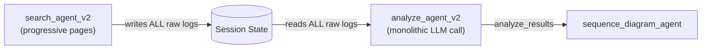
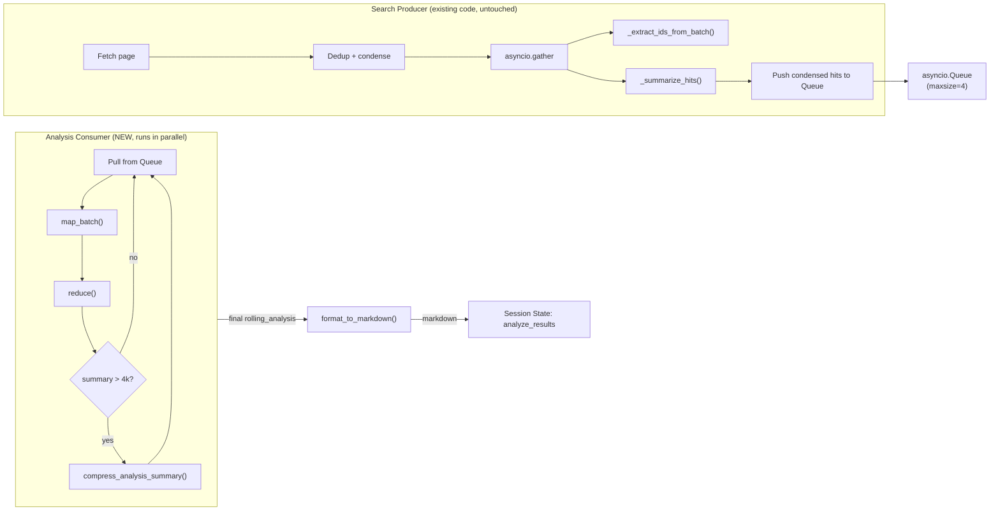

# Incremental Map-Reduce Analysis (Decoupled, Pipelined)

## Principle: Do NOT remove existing search agent code

All existing functions in `search_agent_v2/agent.py` stay untouched:

- `_summarize_hits()` -- kept as-is
- `_SUMMARIZER_INSTRUCTION` -- kept as-is
- `_COMPRESS_INSTRUCTION` -- kept as-is
- `_extract_ids_from_batch()` -- kept as-is
- `_process_hits_progressive()` -- kept as-is (search producer calls it unchanged)
- `TokenBudget` -- kept as-is, reused by new analysis code
- BFS loop structure -- wrapped in a producer coroutine, not rewritten

New analysis logic is **added alongside** as a parallel consumer, not substituted in.

## Current Architecture




Problem: The analyze agent receives all raw logs at once (100k+ tokens), hitting context limits and producing shallow analysis on large log sets.

## Target Architecture (Producer-Consumer Pipeline)




**Timeline showing parallelism:**

```
Search producer:  [fetch p1] [dedup+IDs p1] [fetch p2] [dedup+IDs p2] [fetch p3] [dedup+IDs p3] → done
                       ↓ push              ↓ push              ↓ push
Queue:              [p1]                 [p2]                [p3]
                       ↓ pull              ↓ pull              ↓ pull
Analysis consumer:        [map p1] [reduce]   [map p2] [reduce]   [map p3] [reduce] → done
```

Search keeps fetching pages without waiting for analysis. Analysis processes pages as they arrive from the queue.

**Separation of concerns:**

- `search_agent_v2` owns: OpenSearch fetch, pagination, dedup, BFS frontier, ID extraction, text summarization (all existing, untouched)
- `analyze_agent_v2/incremental.py` owns: structured analysis map instruction, reduce merge logic, analysis compression, markdown formatting, output schema (all new)
- The only coupling is: (1) the function interface imported by search_agent_v2, (2) the `asyncio.Queue` connecting producer and consumer

## The Interface (analyze_agent_v2/incremental.py)

```python
def new_rolling_analysis() -> dict:
    """Factory: returns an empty rolling_analysis structure."""

async def map_batch(
    condensed_hits: list[dict],
    compact_memory: str,
    budget: TokenBudget,
) -> dict:
    """MAP step: analyze one batch of log entries via LLM.
    Input: condensed hits + prior compact memory (few KB).
    Output: MapOutput dict (structured JSON)."""

def reduce(
    rolling: dict,
    map_output: dict,
    evidence_index: list[dict],
) -> tuple[dict, list[dict]]:
    """REDUCE step: merge map output into rolling analysis (pure Python).
    Returns (updated rolling_analysis, updated evidence_index)."""

async def compress_analysis_summary(
    rolling: dict,
    budget: TokenBudget,
) -> dict:
    """Compress rolling_analysis.summary when it exceeds 4k tokens."""

def format_to_markdown(
    rolling: dict,
    evidence_index: list[dict],
    search_summary: dict,
    detailed_analysis: bool,
) -> str:
    """Convert final rolling_analysis into the markdown output structure."""

async def analyze_upload_only(
    sdk_logs: str,
    budget: TokenBudget,
) -> str:
    """Single-pass analysis for upload-only flow (no BFS pagination)."""

async def run_analysis_consumer(
    queue: asyncio.Queue,
    budget: TokenBudget,
) -> tuple[dict, list[dict]]:
    """Consumer coroutine: pulls condensed batches from queue,
    runs map_batch + reduce in a loop until sentinel (None) is received.
    Returns (final rolling_analysis, evidence_index)."""
```

## Map Output JSON Schema

Each batch produces this structured output:

```json
{
  "new_identifiers": {
    "session_ids": [], "call_ids": [], "tracking_ids": [],
    "user_ids": [], "device_ids": []
  },
  "events": [
    {"timestamp": "...", "type": "HTTP|SIP|media|routing",
     "source": "...", "destination": "...", "detail": "..."}
  ],
  "errors": [
    {"timestamp": "...", "code": "...", "service": "...",
     "message": "...", "suspected_cause": "..."}
  ],
  "state_updates": [
    {"timestamp": "...", "transition": "...", "from_state": "...", "to_state": "..."}
  ],
  "evidence_refs": [
    {"doc_id": "...", "index": "...", "timestamp": "...",
     "category": "mobius|sse_mse|wxcas", "relevance": "..."}
  ],
  "delta_summary": "Short text summarizing what this batch revealed"
}
```

## Rolling Analysis Structure

The reducer merges each map output into this object:

```json
{
  "identifiers": { "session_ids": [], "call_ids": [], ... },
  "timeline": [
    {"timestamp": "...", "type": "...", "detail": "..."}
  ],
  "errors": [
    {"timestamp": "...", "code": "...", "service": "...",
     "message": "...", "suspected_cause": "..."}
  ],
  "state_machine": [
    {"timestamp": "...", "transition": "...", "from_state": "...", "to_state": "..."}
  ],
  "cross_service_correlations": [ ... ],
  "summary": "Running narrative <=4k tokens",
  "evidence_count": 42,
  "batch_count": 5
}
```

Rules:

- `summary` capped at ~4k tokens; when exceeded, compress via `compress_analysis_summary()` LLM call
- `identifiers` are deduplicated sets
- `timeline` keeps only milestone events (prune low-value entries when list exceeds ~50)
- `errors` are always preserved (never compressed away)
- `evidence_refs` stored separately in `evidence_index` list (unbounded in storage, only `evidence_count` in the rolling object)

## Files to Change

### 1. NEW: `agents/analyze_agent_v2/incremental.py`

The core new file. Contains ALL incremental analysis logic:

- `_MAP_INSTRUCTION` -- LLM system prompt for the map step. Incorporates domain knowledge from the existing `_ANALYSIS_POINTS` in agent.py (HTTP, SIP, media, timing, errors, cross-service correlation). Receives one batch + compact memory, outputs the structured JSON schema above.
- `_ANALYSIS_COMPRESS_INSTRUCTION` -- LLM prompt for compressing the rolling analysis summary (separate from the search agent's existing `_COMPRESS_INSTRUCTION` which stays in search_agent_v2)
- `new_rolling_analysis()` -- factory that returns an empty structure.
- `map_batch()` -- async, calls LLM via litellm, parses JSON output. Budget-aware (accepts `TokenBudget`).
- `reduce()` -- pure Python merge. Dedup identifiers, append events/errors/state_updates, move evidence_refs to evidence_index, append delta_summary to rolling summary.
- `compress_analysis_summary()` -- async, calls LLM when summary exceeds ~4k tokens.
- `format_to_markdown()` -- converts rolling_analysis dict into the markdown structure matching the current `_OUTPUT_STRUCTURE` sections (Root Cause, Identifiers, Search Scope, Timing, Final Outcome, HTTP/SIP flows).
- `run_analysis_consumer()` -- the consumer coroutine. Pulls batches from the queue, runs map + reduce loop, handles compression. Returns final `(rolling_analysis, evidence_index)`.
- `analyze_upload_only()` -- single-pass LLM analysis for SDK-only uploads (no BFS pagination needed).

### 2. MODIFY: `agents/search_agent_v2/agent.py` (additive only)

No existing code removed. Only additions:

- **Add import** at top: `from analyze_agent_v2.incremental import run_analysis_consumer, new_rolling_analysis, format_to_markdown as format_analysis_to_markdown`
- **Add `analysis_queue`**: create `asyncio.Queue(maxsize=4)` at the start of `_run_async_impl`, before the BFS loop.
- **Add queue push in `_process_hits_progressive()`**: after the existing `asyncio.gather(_extract_ids_from_batch, _summarize_hits)` completes, push the `condensed` hits to the analysis queue. This is a single `await analysis_queue.put(...)` line added after the gather. The existing function body is untouched otherwise.
- **Wrap BFS loop as producer**: the existing BFS loop becomes the body of a `search_producer` inner async function. After the loop ends, push `None` sentinel to signal the consumer to stop.
- **Run producer + consumer in parallel**: `asyncio.gather(search_producer(), run_analysis_consumer(analysis_queue, budget))` replaces the direct BFS loop call.
- **Extend Step 4**: after gather completes, retrieve `(rolling_analysis, evidence_index)` from the consumer result. Call `format_analysis_to_markdown(rolling_analysis, evidence_index, ...)` and store as `analyze_results`. Store `evidence_index` as JSON in session state. All existing Step 4 writes (`chunk_summaries`, `chunk_analysis_summary`, raw logs, etc.) remain unchanged.

### 3. NO CHANGE: `agents/analyze_agent_v2/agent.py`

Kept entirely as-is. The monolithic `calling_agent`, `contact_center_agent`, coordinator `analyze_agent`, all instruction strings, skill toolsets -- all remain. The incremental analysis in `incremental.py` is a parallel path, not a replacement.

### 4. MODIFY: `agents/root_agent_v2/agent.py`

- Remove `analyze_agent` from the `SequentialAgent`: change `[search_agent, analyze_agent, sequence_diagram_agent]` to `[search_agent, sequence_diagram_agent]` since analysis now happens incrementally during search.
- The monolithic analyze_agent code stays in `agent.py` but is no longer wired into the pipeline.

### 5. MODIFY: `agents/query_router/agent.py`

- Upload-only path: replace `analyze_agent.run_async(ctx)` with a call to `analyze_upload_only(sdk_logs, budget)` from `incremental.py`, store result in `ctx.session.state["analyze_results"]`

### 6. NO CHANGE: `agents/chat_agent/agent.py`

- Reads `{analyze_results}` -- unchanged (now written by search_agent_v2 via format_to_markdown)
- `_log_cache` import and fallback -- unchanged
- Skill toolset imports from analyze_agent_v2 -- unchanged

## Key Design Decisions

- **Producer-consumer parallelism**: Search (producer) and analysis (consumer) run concurrently via `asyncio.gather`. Connected by `asyncio.Queue(maxsize=4)` with backpressure.
- **Additive, not destructive**: All existing search agent functions (`_summarize_hits`, `_SUMMARIZER_INSTRUCTION`, `_COMPRESS_INSTRUCTION`, `TokenBudget`, `_process_hits_progressive`, etc.) remain untouched. Only additions: queue creation, one `queue.put()` line after gather, producer/consumer wiring.
- **Search never blocked by analysis**: search continues fetching + extracting IDs while analysis processes prior pages in the background.
- **Analysis still sequential internally**: reduce must happen in order (page 1 before page 2), but this is handled naturally by the queue's FIFO ordering.
- **Clean interface boundary**: search_agent_v2 imports `run_analysis_consumer` + `format_to_markdown` from `incremental.py`. No analysis logic in search code.
- **Compact memory**: map step receives only `rolling_analysis["summary"]` (few KB) as prior context.
- **Evidence index**: stored separately (unbounded in storage). Only `evidence_count` in the rolling object.
- **4k token cap on analysis summary**: enforced by `reduce()` calling `compress_analysis_summary()`.
- **Output structure**: `format_to_markdown()` produces the same markdown sections as `_OUTPUT_STRUCTURE` for downstream compatibility.
- **analyze_agent_v2/agent.py kept intact**: monolithic agent code remains available but is unwired from the pipeline. Can be re-wired if needed.
- **Backpressure**: `maxsize=4` on the queue means if analysis falls 4+ pages behind, search will `await` on `queue.put()` until a slot opens. Prevents unbounded memory growth.

